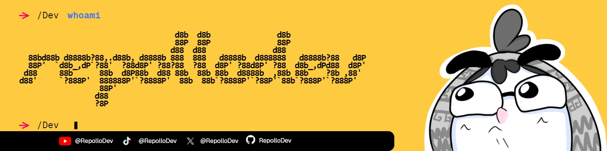

<h1 align="center">Buenas ✌️! Soy <b>RepolloDev</b> 🥬</h1>

    
    
    

Soy un desarrollador especializado
en la creación de aplicaciones web,
me gusta aprender sobre informática
y poder compartir mis conocimientos
de forma simplificada.

<pre>
🥳 Mis gustos son:
    - El desarrollo web 🌐
    - La música (Escuchar y tocar) 🎸
    - El dibujo 🎨
    - Los videojuegos 🎮
    - 👀 Leer, pero no documentación 🤫
    - El repollo y el pollo 🥬🍗
    - Salir a correr 💨
</pre>

Durante mi aprendizaje he llegado a
tomar cariño por las tecnologías y
ver cómo estas pueden ayudar a
desarrollar proyectos increíbles.

    
    
    
    

